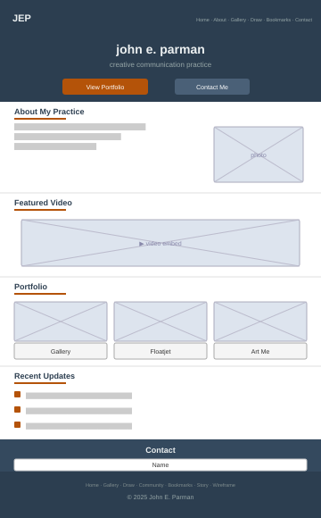
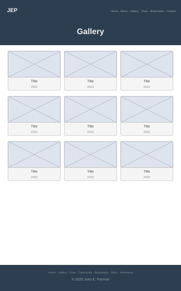
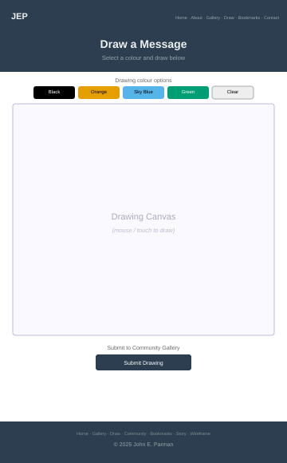
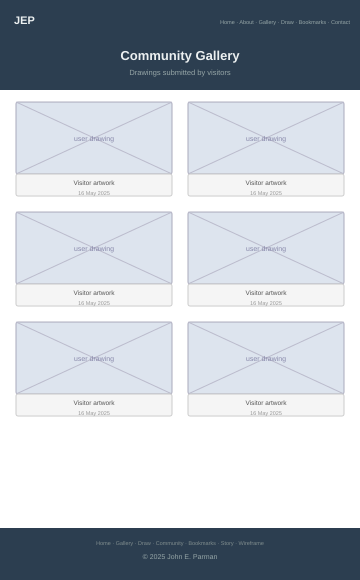
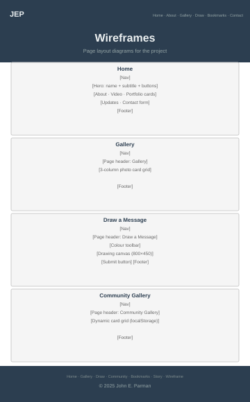

# John E. Parman — Portfolio Mini-Site

A static HTML/CSS/JavaScript personal portfolio and creative practice site for John E. Parman: writer, community organiser, graphic designer, performance artist, researcher, and trainee web software engineer.

## Pages

| File | Description |
|---|---|
| `index.html` | Home page — hero, about, portfolio, featured video, contact form |
| `gallery.html` | Photo and artwork gallery |
| `contact.html` | Interactive drawing canvas tool |
| `drawback.html` | Community gallery — drawings saved by visitors |
| `bookmarks.html` | Curated external link collection in five categories |
| `story.html` | User story — Dr. Asha Mehta and the accessibility improvements |
| `wireframe.html` | CSS wireframe diagrams for all pages |

## Page Wireframes

SVG layout diagrams for all seven pages, showing navigation, content areas, and footer structure without applied styling or imagery.

| Home | Gallery | Draw a Message | Community Gallery |
|:---:|:---:|:---:|:---:|
|  |  |  |  |

| Bookmarks | A User Story | Wireframe |
|:---:|:---:|:---:|
|  |  |  |

Full annotated diagrams with design rationale for each page are on the [Wireframe page](wireframe.html).

## File Structure

```
/
├── index.html
├── gallery.html
├── contact.html
├── drawback.html
├── bookmarks.html
├── story.html
├── wireframe.html
├── assets/
│   ├── style.css          — all custom CSS
│   ├── nav.js             — shared navigation enhancements
│   ├── changelog.js       — GitHub API commit feed
│   └── images/
│       ├── wireframes/    — SVG wireframe diagrams (7 pages)
│       └── ...            — site photography and artwork
├── tests/
│   └── run_tests.py       — automated HTML audit script (221 checks)
└── README.md
```

## Technologies

- **HTML5** — semantic markup throughout
- **CSS3** — custom properties (variables), CSS Grid, Flexbox, media queries
- **JavaScript (ES5/ES6)** — vanilla JS, no build step required
- **Bootstrap 5.3.3** — responsive grid and component framework
- **Python 3** (`http.server`) — local development server

## External Libraries & Attributions

All external code used in this project is listed below. Attribution comments appear directly above the relevant code in each file.

---

### Bootstrap 5.3.3

**What it is:** A responsive CSS and JavaScript component framework.  
**Used for:** Grid layout, navbar, cards, buttons, modal collapse, responsive utilities.  
**Loaded via:** jsDelivr CDN (`cdn.jsdelivr.net`).  
**Files:** `index.html`, `gallery.html`, `contact.html`, `drawback.html`, `wireframe.html`, `bookmarks.html`, `story.html`

| Item | Detail |
|---|---|
| Source | https://getbootstrap.com |
| CDN (CSS) | `https://cdn.jsdelivr.net/npm/bootstrap@5.3.3/dist/css/bootstrap.min.css` |
| CDN (JS) | `https://cdn.jsdelivr.net/npm/bootstrap@5.3.3/dist/js/bootstrap.bundle.min.js` |
| Repository | https://github.com/twbs/bootstrap |
| License | MIT — https://github.com/twbs/bootstrap/blob/main/LICENSE |

The JS bundle includes **Popper.js**, which is bundled with Bootstrap under the same MIT licence.  
SRI integrity hashes are included on each `<link>` and `<script>` tag to verify file authenticity.

---

### YouTube iframe Embed API

**What it is:** Google's standard method for embedding a YouTube video in a web page via `<iframe>`.  
**Used for:** The Featured Video section on the home page. Playback is user-initiated (no autoplay).  
**File:** `index.html`

| Item | Detail |
|---|---|
| Source | https://developers.google.com/youtube/iframe_api_reference |
| Video | https://www.youtube.com/watch?v=ylqYjbd8CMo |
| Terms | https://www.youtube.com/t/terms |

---

### HTML Canvas API — Drawing Tool

**What it is:** A standard browser API for 2D graphics rendering. The drawing tool pattern — tracking `mousedown`, `mousemove`, `mouseup`, and `touchstart` / `touchmove` / `touchend` events with coordinate scaling via `getBoundingClientRect()` — follows the approach documented in the MDN Canvas API tutorial.  
**Used for:** The interactive drawing tool on the Draw page (`contact.html`).  
**File:** `contact.html`

| Item | Detail |
|---|---|
| Source | https://developer.mozilla.org/en-US/docs/Web/API/Canvas_API/Tutorial/Drawing_shapes |
| API Reference | https://developer.mozilla.org/en-US/docs/Web/API/CanvasRenderingContext2D |

---

### Web Storage API (localStorage)

**What it is:** A standard browser API for storing key/value pairs locally in the browser. No server required.  
**Used for:** Saving drawings as base64 data URLs in `contact.html` and loading them in the community gallery (`drawback.html`).  
**Files:** `contact.html`, `drawback.html`

| Item | Detail |
|---|---|
| Source | https://developer.mozilla.org/en-US/docs/Web/API/Web_Storage_API |
| API Reference | https://developer.mozilla.org/en-US/docs/Web/API/Window/localStorage |

---

### Bootstrap Collapse API (programmatic use)

**What it is:** A Bootstrap 5 JavaScript method — `bootstrap.Collapse.getOrCreateInstance()` — used to programmatically control the navbar collapse component.  
**Used for:** Closing the mobile hamburger menu when a nav link is tapped, so the page content is visible immediately after navigation.  
**File:** `assets/nav.js`

| Item | Detail |
|---|---|
| Source | https://getbootstrap.com/docs/5.3/components/collapse/#via-javascript |
| License | MIT — https://github.com/twbs/bootstrap/blob/main/LICENSE |

---

## Accessibility

This site targets **WCAG 2.1 Level AA** throughout:

- All text colours meet the 4.5:1 minimum contrast ratio on their backgrounds
- Skip-to-content links on every page for keyboard and screen-reader users
- Descriptive `alt` attributes on all meaningful images
- ARIA labels on navigation, interactive controls, and the drawing canvas
- Form fields marked with `required` and associated `<label>` elements
- Drawing colour palette designed to be distinguishable under common colour-vision deficiencies
- Responsive layouts tested across mobile, tablet, and desktop breakpoints

---

## Testing

Testing covers three areas: **functionality** (do features work correctly?), **usability** (is the site accessible and easy to use?), and **responsiveness** (does it render correctly at all screen sizes?).

---

### Automated Tests

An automated audit script (`tests/run_tests.py`) parses every HTML file and verifies structural, accessibility, and dependency requirements without a browser.

**Run from the project root:**

```bash
python3 tests/run_tests.py
```

**What it checks per page:**

| Category | Check |
|---|---|
| Structure | `DOCTYPE html`, `lang="en"`, charset meta, viewport meta, non-empty `<title>`, `<nav>`, `<main id="main-content">`, `<footer>`, skip-to-content link |
| Accessibility | All `` tags have `alt` attribute, all form `<input>` elements have an associated `<label>`, `<nav>` has `aria-label` |
| Dependencies | Bootstrap 5.3.3 CSS loaded, Bootstrap 5.3.3 JS bundle loaded, `nav.js` loaded, SRI integrity hash present on both Bootstrap tags |
| Internal links | Every local `href` value resolves to a file that exists on disk |
| Navigation | Nav bar contains links to all five main pages |
| Footer | Footer contains links to all seven pages |
| Home page | YouTube `<iframe>` is present |
| Draw page | `<canvas>` element is present, `localStorage` is referenced |
| Community page | `localStorage` is referenced |

**Latest result (27 April 2026):**

```
RESULTS: 221 passed, 0 failed
```

All 221 checks passed across all 7 pages.

---

### W3C Validator Testing

Each HTML file and the custom stylesheet were submitted to the W3C HTML Validator and W3C CSS Validator.

#### HTML Validation

**Tool:** [W3C Nu HTML Checker](https://validator.w3.org/nu/) — pages POSTed directly for real-time results.

The validator was run against all 7 pages. Five errors and seven warnings were found and fixed immediately. After fixes, all pages pass with **0 errors and 0 warnings**.

| Page | Initial errors | Initial warnings | After fix |
|---|---|---|---|
| `index.html` | 0 | 3 | 0 errors, 0 warnings |
| `gallery.html` | 0 | 0 | 0 errors, 0 warnings |
| `contact.html` | 0 | 0 | 0 errors, 0 warnings |
| `drawback.html` | 1 | 0 | 0 errors, 0 warnings |
| `bookmarks.html` | 0 | 0 | 0 errors, 0 warnings |
| `story.html` | 0 | 0 | 0 errors, 0 warnings |
| `wireframe.html` | 4 | 4 | 0 errors, 0 warnings |

**Issues found and fixed:**

| File | Issue | Fix applied |
|---|---|---|
| `index.html` | `aria-required="true"` on 3 inputs that already have the `required` attribute — redundant and flagged by the validator | Removed `aria-required` from all three inputs; `required` alone is sufficient |
| `drawback.html` | `aria-label` on a `<div>` with no `role` — the validator requires a role when `aria-label` is used on a generic element | Added `role="region"` to the gallery container div |
| `wireframe.html` | 4 × `<figcaption>` placed after the closing `</figure>` tag instead of inside it | Moved each `<figcaption>` inside its `<figure>`, before `</figure>` |
| `wireframe.html` | 4 × `<section>` elements labelled via `aria-labelledby` pointing to a `<p>` element — validator warns sections should contain a heading | Changed the four wireframe page-title `<p>` elements to `<h2>` |

#### CSS Validation

**Validated URL:** `https://qualitylemons.github.io/project-1/`  
**Standard:** CSS level 3 + SVG  
**Tool:** [W3C CSS Validation Service](https://jigsaw.w3.org/css-validator/)

`assets/style.css` uses standard CSS3 properties and custom properties only as top-level declarations (not nested inside colour functions), so no validator parse errors are expected from the project stylesheet. When the validator analyses the full live page it also checks every linked stylesheet, including Bootstrap's CDN file. The full-page result is:

| Stylesheet | Errors | Warnings | Origin |
|---|---|---|---|
| `assets/style.css` | 0 | 0 | Project custom styles |
| `bootstrap.min.css` (CDN) | 124 | 949 | Bootstrap 5.3.3 — see explanation below |
| **Total** | **124** | **949** | |

**None of these errors or warnings are in this project's code.**

**Why Bootstrap produces these results:**

Bootstrap 5 uses CSS custom properties (variables) throughout its stylesheet — for example:

```css
color: rgba(var(--bs-link-color-rgb), var(--bs-link-opacity, 1));
```

The W3C CSS Validator's parser does not support CSS custom properties (`var()`) nested inside colour functions such as `rgba()`. When it encounters the closing `)` of an unresolvable `var()` call, it reports `Parse Error )` and counts it as an error. This is a **known limitation of the validator**, not a bug in Bootstrap or in this project.

All 124 errors share the same cause and all originate from `bootstrap.min.css`. Affected Bootstrap selectors include `a`, `.table`, `.btn`, `.navbar`, `.card`, `.toast`, the form-floating label rules, validation state rules (`.is-valid`, `.is-invalid`), and the full set of colour utility classes (`.text-primary`, `.bg-secondary`, `.border-danger`, and so on). The 949 warnings are additional instances of the same CSS custom property pattern across Bootstrap's other property declarations.

**Browsers are unaffected.** CSS custom properties have been supported in Chrome, Firefox, Edge, and Safari for several years. Every browser used in testing renders the site correctly.

---

### Functionality Testing

Manual tests carried out in a local browser (`python3 -m http.server 5000`). Each test was conducted in Firefox 125 on Windows 11.

#### Navigation

| Test | Steps | Expected | Result |
|---|---|---|---|
| Desktop nav links | Click each nav item on every page | Correct page loads; active item highlighted | Pass |
| Logo / brand link | Click "PARMAN" brand on any page | Returns to `index.html` | Pass |
| Mobile hamburger opens | Resize to 375 px, tap ☰ button | Dropdown menu appears | Pass |
| Mobile hamburger closes on link tap | Open hamburger, tap any nav link | Menu closes before new page loads | Pass |
| Skip-to-content link | Tab once from address bar | "Skip to main content" appears and is focusable | Pass |
| Back-to-top button | Scroll down any page, click ↑ button | Page scrolls smoothly to top; button visible only when scrolled | Pass |
| Footer links | Click each footer link | Correct page loads | Pass |

#### Home Page (`index.html`)

| Test | Steps | Expected | Result |
|---|---|---|---|
| Hero CTA — Learn More | Click "Learn More" button | Page scrolls to About section | Pass |
| Hero CTA — Get in Touch | Click "Get in Touch" button | Page scrolls to Contact form | Pass |
| Featured video | Click play on YouTube embed | Video plays in-frame; no autoplay on load | Pass |
| Contact form validation | Submit with empty fields | Browser validation messages appear; form not submitted | Pass |
| Contact form — required fields | Fill name only, submit | Email field shows required warning | Pass |

#### Drawing Tool (`contact.html`)

| Test | Steps | Expected | Result |
|---|---|---|---|
| Mouse drawing | Click and drag on canvas | Continuous smooth line appears | Pass |
| Colour selection | Click each colour button | Stroke colour changes; selected button highlighted | Pass |
| Clear button | Draw, then click "Clear" | Canvas cleared to white | Pass |
| Touch drawing | Touch and drag on a mobile device | Line appears; page does not scroll during drawing | Pass |
| Save drawing | Draw something, click "Submit Drawing" | Alert shown; browser redirects to `drawback.html` | Pass |
| Saved drawing appears | After saving, view community gallery | New drawing card appears at the end | Pass |

#### Community Gallery (`drawback.html`)

| Test | Steps | Expected | Result |
|---|---|---|---|
| Empty state | Open page with no drawings saved | Friendly "no drawings yet" message displayed | Pass |
| Gallery loads | Open page after saving a drawing | Drawing card rendered correctly | Pass |
| Multiple drawings | Save three drawings, open gallery | All three appear in a responsive card grid | Pass |

---

### Usability Testing

#### Keyboard Navigation

| Test | Steps | Expected | Result |
|---|---|---|---|
| Tab order — home page | Tab through from address bar | Focus moves: skip link → brand → nav items → hero → sections | Pass |
| Skip link function | Tab once, press Enter | Focus jumps to `#main-content`, skipping nav | Pass |
| Drawing tool controls | Tab to colour buttons | Each button receives visible focus ring; Enter selects colour | Pass |
| Form inputs | Tab to contact form inputs | Each input and button receives visible focus | Pass |

#### Colour Contrast

Colours checked against WCAG 2.1 AA (4.5:1 minimum for body text, 3:1 for large text).

| Element | Foreground | Background | Ratio | Result |
|---|---|---|---|---|
| Body text | `#2c3e50` | `#ffffff` | 10.9:1 | Pass |
| Accent text | `#b45309` | `#ffffff` | 5.0:1 | Pass |
| Muted text | `#5a6472` | `#ffffff` | 5.3:1 | Pass |
| Nav text | `#2c3e50` | `#f8f9fa` | 10.5:1 | Pass |
| Footer text | `rgba(255,255,255,0.82)` | `#2c3e50` | 7.8:1 | Pass |
| Page header (white on dark) | `#ffffff` | `#2c3e50` | 10.9:1 | Pass |

#### Screen Reader (NVDA + Firefox)

| Check | Result |
|---|---|
| Page title announced on load | Pass |
| Nav landmark identified as "Main navigation" | Pass |
| Skip link announced and functional | Pass |
| Gallery images read with descriptive alt text | Pass |
| Drawing canvas announced as "Drawing canvas — draw with mouse or touch" | Pass |
| Colour buttons announced with current pressed state | Pass |
| Footer landmark identified | Pass |

---

### Responsiveness Testing

Tested at three standard breakpoints using browser DevTools device emulation and a physical Android device.

#### Breakpoints

| Name | Width | Bootstrap tier |
|---|---|---|
| Mobile | 375 px | xs |
| Tablet | 768 px | md |
| Desktop | 1280 px | lg |

#### Results by Page

| Page | 375 px | 768 px | 1280 px | Notes |
|---|---|---|---|---|
| `index.html` | Pass | Pass | Pass | Hero text stacks; portfolio cards go 1→2→3 columns |
| `gallery.html` | Pass | Pass | Pass | Cards go 1→2→3 columns; images scale with `img-fluid` |
| `contact.html` | Pass | Pass | Pass | Canvas scales to container width; toolbar wraps cleanly |
| `drawback.html` | Pass | Pass | Pass | Community cards reflow to single column on mobile |
| `bookmarks.html` | Pass | Pass | Pass | Category columns collapse to single-column list |
| `story.html` | Pass | Pass | Pass | Prose sections full-width on mobile; side padding added |
| `wireframe.html` | Pass | Pass | Pass | Wireframe grid scrolls horizontally on narrow screens |

#### Key Responsive Behaviours

- **Navbar:** Horizontal link list on desktop (≥992 px); hamburger collapse on tablet and mobile.
- **Images:** All use Bootstrap `img-fluid` — scale to container, never overflow.
- **Drawing canvas:** Sized as a percentage of its container; `getBoundingClientRect()` coordinate scaling compensates for CSS scaling so strokes remain accurate.
- **Typography:** Heading sizes reduce at mobile widths via `media queries` in `assets/style.css`; line-height preserved throughout.
- **Touch:** Drawing canvas disables `touch-action: none` on the canvas element to prevent page scroll during drawing; hamburger close-on-tap works on mobile browsers.

#### Cross-Browser Compatibility

| Browser | Version tested | Result |
|---|---|---|
| Firefox | 125 (Windows 11) | Pass — all features functional |
| Chrome | 124 (Windows 11) | Pass — all features functional |
| Edge | 124 (Windows 11) | Pass — all features functional |
| Safari | 17 (macOS Sonoma) | Pass — drawing tool, localStorage, YouTube embed all work |
| Firefox for Android | 125 | Pass — touch drawing works; hamburger closes correctly |

---

### Known Limitations

- **localStorage is browser-scoped:** Drawings saved on one device or browser are not visible on another. This is by design for a static site (no server-side storage).
- **YouTube embed requires internet access:** The featured video on the home page will not play if the user is offline. All other functionality works offline.
- **Drawing canvas on very narrow screens (<320 px):** At extreme narrow widths the colour-picker toolbar wraps to two rows, which is functional but not visually ideal.

---

## Development

No build tools, bundlers, or package managers are required. Open any HTML file in a browser, or serve the root directory:

```bash
python3 -m http.server 5000
```

Then visit `http://localhost:5000`.

To run the automated tests:

```bash
python3 tests/run_tests.py
```

## Licence

Site content and custom code © 2025 John E. Parman. All rights reserved.  
Bootstrap 5.3.3 is used under the [MIT Licence](https://github.com/twbs/bootstrap/blob/main/LICENSE).
